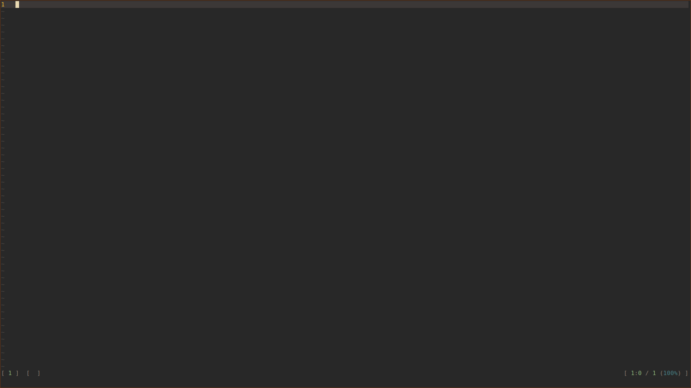

# telescope-ros.nvim

ROS(2) package selector for [telescope.nvim](https://github.com/nvim-telescope/telescope.nvim) using colcon.



The picker lets you select a ros package from your workspace and then subsequently starts a `find_file` operation in that package, somewhat similar to how `colcon edit` and `rosed` are used.

## Installation

Install the plugin and requirements

Using lazy.nvim

```lua
{ 
    "nvim-telescope/telescope.nvim",

    dependencies = {
        "nvim-lua/plenary.nvim",
        "bi0ha2ard/telescope-ros.nvim"
    }
}
```

Using vim-plug

```
" Telescope requirements
Plug 'nvim-lua/plenary.nvim'
" Telescope
Plug 'nvim-telescope/telescope.nvim'
" This plugin
Plug 'bi0ha2ard/telescope-ros.nvim'
```

## Telescope setup

After the telescope setup, load the plugin with

```
lua require('telescope').load_extension('ros')
```

The path to the `colcon` executable can be configured:

```lua
require('telescope').setup{
    extensions = {
        ros = {
            colcon = "colcon" -- Must be in $PATH
            -- colcon = vim.loop.os_homedir() .. "/venvs/colcon/bin/colcon", -- or run directly from a venv
        }
    }
}
```

The default is `colcon`.
[cols](https://github.com/bi0ha2ard/cols) can be used as a drop-in replacement for faster package discovery.

The `:checkhealth` command can be used to check whether the executable is found.

At least `colcon-ros` and `colcon-package-information` must be installed to populate the package list.

## Usage

Telescope integrates the extension into the `:Telescope` command, and you can start the picker with
```
:Telescope ros packages
```
which will show the packages from nvim's cwd.

You can also run the picker directly from lua:
```vim
:lua require'telescope'.extensions.ros.packages{}

```

If you want to overwrite the directory in which colcon looks for packages, you can overwrite the cwd:
```vim
" Directly specify a path
nnoremap <silent> <leader>dr :lua require'telescope'.extensions.ros.packages{cwd="<path to your WS root"}

" Or from an environment variable that you set previously
:lua require'telescope'.extensions.ros.packages{cwd=os.getenv("ROS_WORKSPACE") or "."}

```

## Convenience pickers
These require a recent Neovim build with `vim.fs` or the `neovim/nvim-lspconfig` plugin for root pattern detection.

- `files` runs a `find_files` in the package root of the file in the current buffer
- `grep_string` runs a `grep_string` in the package root of the file in the current buffer
- `live_grep` runs a `live_grep` in the package root of the file in the current buffer
